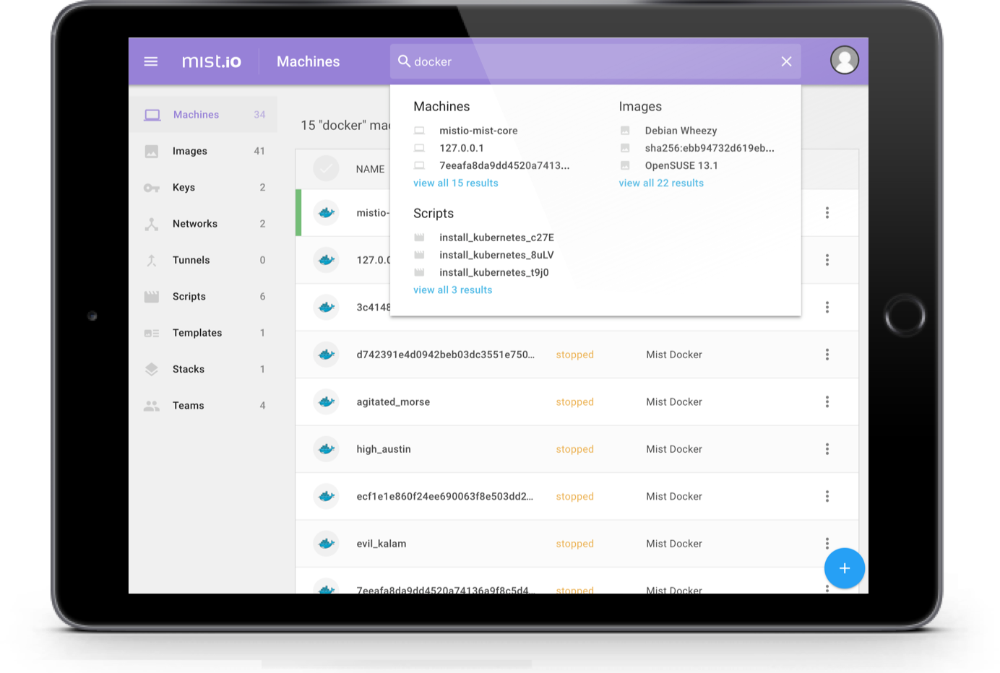
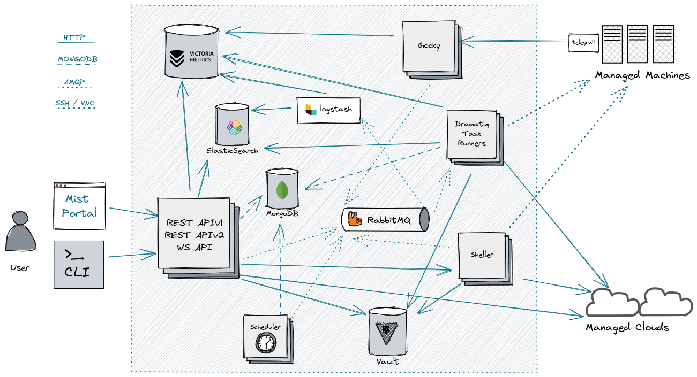

<h1 align="center">Mist</h1>

  <i>Community Edition </i>
    
  
   
  <b><a href="./docs/git/FEATURES.md">Features</a></b> | <b><a href="./docs/git/DOCKER.md">Getting Started</a></b> | <b><a href="./docs/git/ROADMAP.md">Road Map</a></b> | <b><a>Documentation</a></b> | <b><a href="https://github.com/mistcommunity/mist-ce/issues">Issues</a></b>

mist-ce is an open-source, community maintained fork of [mist.io](https://github.com/mistio/mist-ce), a multi-cloud management platform aiming to simplify and reduce the cost of administering public clouds, private clouds, hypervisors, containers and bare metal servers. 

 

## 📄 Contents
- [🔗 Quick Links](#links)
- [ℹ️ About](#about)
- [🧐 Overview](#overview)
- [🖼️ Screenshots](#screenshots)
- [🔠 Terminology](#terminology)
- [✨ Features](#features)
- [📖 Documentation](#documentation)
- [🏗️ Architecture](#architecture)
- [🚀 Installation](#installation)
- [🤔 Questions, Feedback](#questions)

 

## 🔗 Quick Links 

|  | Link                                                                | Description
|--|---------------------------------------------------------------------|-----------------
|💡|[CONTRIBUTING](./docs/git/CONTRIBUTING.md)                          | Help to get started on contributing
|⚠️|[ISSUES](https://github.com/mistcommunity/mist-ce/issues)           | Check for bug reports & feature requests
|🗪|[DISCUSSIONS](https://github.com/mistcommunity/mist-ce/discussions)  | Discuss the direction of mist
|🔀|[PULL REQUESTS](https://github.com/mistcommunity/mist-ce/pulls)     | Existing pull requests
|👨🏻‍💻|[DEVELOPERS](./docs/git/DEVELOPERS.md)                              | Guide on developing
|📝|[CHANGELOG](./docs/git/CHANGELOG.md)                                | Current and legacy changelog
|✨|[FEATURES](./docs/git/FEATURES.md)                                  | Feature tracking list
|🗺️|[ROADMAP](./docs/git/ROADMAP.md)                                    | Rough development roadmap
|🌿|[BRANCHES](./docs/git/BRANCHES.md)                                  | Audit of legacy branches
|🔒|[SECURITY](./docs/git/SECURITY.md)                                  | Security information
|🤗|[CONDUCT](./docs/git/CODE_OF_CONDUCT.md)                            | Code of Conduct

 

# ℹ️ About
> [!NOTE]  
> In December 2023, Mist.io Inc was [acquired by Dell Technologies](https://mist.io/blog/2023-12-18-mist-joins-dell-isg-edge). Since then, the Enterprise Edition (EE) and Hosted Service (HS) are no longer available, while the Community Edition (CE) has not been maintained besides some security fixes contributed by the community.

From the post, they talk about how the sale impacted Mist Community Edition:

> Impact on Mist Community Edition
> Unfortunately, our current workload does not leave us any capacity to keep maintaining our open source offering. At the same time, Dell Technologies has no immediate plans to release new versions of the Mist Community Edition. The open source code will remain archived on github.com/mistio and we will welcome any community efforts to bring it back to life.

This project, [mistcommunity/mist-ce](https://github.com/mistcommunity/mist-ce), aims to update the code so that Mist Community Edition works again, and is usable as an open source software. To see the status look at the [issues](https://github.com/mistcommunity/mist-ce/issues) page, or to try and spin it up, or help debug issues to get it working again, see the [CONTRIBUTING](./docs/git/CONTRIBUTING.md) guide.

 

# 🧐 Overview
Mist simplifies multi-cloud management. It offers a unified interface from where you can manage public clouds, private clouds, hypervisors, containers and bare metal servers. With Mist you can perform common management tasks like provisioning, orchestration, monitoring, automation and cost analysis.

- 🛠️**Extensibility**: Mist comes with a [RESTful API](./api/) and a [CLI](https://github.com/mistcommunity/mist-cli), so you can easily integrate it into your existing workflows.
- 💸**Reduce Costs**: Original Mist users included organizations like Juniper Networks, SevOne, Windstream, National Bank of Greece, Shoprite and more. They all report faster roll-outs while reducing their bills and management overheads by 40%-60%.
- ✨**Simplicity**: A core focus is to simplify the user experience as much as possible
- 🧾**Open Source**: Mist Community Edition (CE) is licensed under the Apache License v2. It is ideal for teams with a DIY approach.
- 📱**Mobile Friendly**: Originally designed to be functional on a mobile device.

 

# 🖼️ Screenshots

  

  
  

> These screenshots are from the original working project and do not represent the current state.

 

# 🔠 Terminology

Some terms are used very often in Mist. Below is a list of the most basic ones to help you avoid any confusion:

| | Term         | Description
|--|-------------|---------------------------
|☁︎| **Cloud**   | Any service that provides on-demand access to resources, e.g. public clouds, private clouds, hypervisors, container hosts, Kubernetes clusters, bare metal servers, etc.
|🖥️| **Machine** | Any computing resource. There are many types of machines and some machines may contain other machines.
|💾| **Volume**  | Any physical or virtual data storage device, e.g. physical HDD/SSD, cloud disks, EBS volumes etc. Volumes may be attached on machines. Volumes may be provisioned along with machines or independently.
|🌐|**Network**  | Private network spaces that machines can join, e.g. AWS VPCs.
|📜|**Script**   | An executable (e.g. bash script) or an Ansible playbook that can run on machines over SSH. Scripts may be added inline or by a reference to a tarball or a Git repository.
|📝 | **Template**  | A blueprint that describes the full lifecycle of an application that may require multiple computing resources, network, storage and additional configurations. For example, the provided Kubernetes template enables the deployment of a Kubernetes cluster on any cloud and provides workflows to easily scale the cluster up or down. Currently, Mist supports Cloudify blueprints. Helm and Terraform support is coming soon.
|🗃️| **Stack**     | The deployment of a template is a stack. A stack may include resources (e.g. machines, networks, volumes etc) and provides a set of workflow actions that can be performed. A stack created by the Kubernetes template refers to a Kubernetes cluster. It includes references to all control and data plane nodes. It provides scale up & down workflows that can be applied to the cluster.
|⚫| **Tunnel** | A secure, point-to-point VPN tunnel enabling Mist to access infrastructure that is not on a publicly addressable network space.

 

# ✨ Features

See [FEATURES.md](./docs/git/FEATURES.md) for details.

### 💡 Technologies
- Support for more than 20 infrastructure technologies.

### 💸 Cost Management

- Instant visibility of all the available resources across clouds, grouped by tags.
- Instant reporting/estimation of the current infrastructure costs.
- Compare current & past costs, correlate with usage, provide right-sizing recommendations (EE & HS only - TBA).

### 🔐 RBAC
- Set fine-grained access control policies per team, tag, resource and/or action (EE & HS only  - TBA).
- Set governance constraints: e.g. quotas on cost per user/team, required expiration dates (EE & HS only  - TBA).

### 🔄 Deployment & Lifecycle
- Provision new resources on any cloud including machines, clusters, volumes, networks, zones and DNS records.
- Deploy and scale Kubernetes clusters on any supported cloud.
- Perform lifecycle actions on existing resources, e.g. stop, start, reboot, resize, destroy, etc.
- Set schedules that trigger scripts or machine lifecycle actions.
- Upload infrastructure templates that may describe complex deployments and workflows (EE & HS only  - TBA).

### 👀 Monitoring
- Instant audit logging for all actions performed through Mist or detected through continuous polling.
- Monitor machines, display real time system & custom metrics and store them for long term access.

### 🤖 Automation
- Upload scripts and run them on any machine while enforcing audit logging and centralized control of SSH keys.
- Command shell on any machine within the browser or through the CLI, enforcing audit logging and centralized control of keys.
- Set rules on metrics or logs that trigger notifications, webhooks, scripts or lifecycle actions.

 

# 📖 Documentation
After the sale to Dell the offical documention site [docs.mist.io](https://docs.mist.io) disappeared, so the latest documentation we have is available on the Internet Archive's Wayback Machine: [docs.mist.io](https://web.archive.org/web/20231002042043/https://docs.mist.io/) (last updated October 2, 2023)

Documentation will be available as a GitHub pages site and as a self-hosted container (TBA).

> [!IMPORTANT]
> While the original [mist.io](https://mist.io/) site exists, we have no access to it, and it is not part of this project.

 

# 🏗️ Architecture

> [!NOTE]
> This is the architecture laid out by the original developers, the general design will likely stay they same, however the individual services may change over time.

Mist is a cloud native application split into microservices which are packaged as Docker containers. It can be deployed on a Kubernetes cluster using Helm or a single host with Docker Compose.

The most notable components are the following:

|                                                                                                         | Function            | Description
|---------------------------------------------------------------------------------------------------------|---------------------|-------------- 
|                | **Mist UI**         | A web application built with Web Components and Polymer
|           | **REST API**        | Backend service that serves requests from clients
|       | **WebSocket API**   | Sends real-time updates to connected clients and proxies shell connections
|         | **Hubshell**        | A service that opens SSH connections to machines or shell connections using the Docker API
|         | **Dramatiq**        | Workers, running asynchronous jobs
|      | **APScheduler**     | Scheduler that schedules polling tasks, rule checks, as well as user defined scheduled actions.
|         | **RabbitMQ**        | Message queue service.
|          | **MongoDB**         | The main database
|    | **Elasticsearch**   | For storing and searching logs
|         | **Logstash**        | For routing logs to Elasticsearch
|         | **Telegraf**        | A data collection agent, installed on monitored machines.
|            | **Gocky**           | The relay to receive and pre-process monitoring metrics
|         | **InfluxDB**        | Time series database for metrics
|  | **VictoriaMetrics** | Alternative time series database.

- The user interacts with the RESTful Mist API through client apps like the Mist UI in the browser or command line tools (e.g. cURL, Mist CLI, etc.).
- The Mist UI, apart from invoking the RESTful API, also establishes a WebSocket connection. This is used to receive real time updates and to proxy shell connections to machines.
- The Mist API server interacts with the respective API's of the target clouds, either directly, or by adding tasks that get executed asynchronously by Dramatiq workers. The messaging is following the AMQP protocol and gets coordinated by RabbitMQ.
- The main data store is MongoDB. Logs are being stored in Elasticsearch. Time series data go to either VictoriaMetrics or InfluxDB, depending on the installation.
- Rule checks, polling tasks & user tasks are triggered by the scheduler service. Whenever a shell connection is required (e.g. SSH, Docker shell, etc.), Sheller establishes the connection and makes it available through the WebSocket API.

 

# 🚀 Installation
> [!WARNING]
> NOT FOR PRODUCTION USE! \
> With the current state of the codebase, we are still identifying what does and does not work. We can't guarantee a feature is operational **see [FEATURES](./docs/git/FEATURES.md)**. \
> If you want to contribute by testing features, **see [CONTRIBUTING](./docs/git/CONTRIBUTING.md)**

*tl;dr: **docker compose up -d***

We aim to simplify the process in the future, as well as including a Traefik docker-compose.yml configuration example. However, if you know what you are doing and are a veteran in the world self-hosting, you can modify the docker-compose.yml to suite your specific setup.

You can install Mist in several ways, depending on your needs:

- **Kubernetes** - [KUBERNETES.md](./docs/git/KUBERNETES.md)
- **Docker** - [DOCKER.md](./docs/git/DOCKER.md)
- **Development** - [DEVELOPERS.md](./docs/git/DEVELOPERS.md)
- **~~App Store~~** - [MARKETPLACE.md](./docs/git/MARKETPLACE.md)

 

# 🤔 Questions, Feedback
|  | Link                                                               | Description
|--|--------------------------------------------------------------------|-----------------
|⚠️|[ISSUES](https://github.com/mistcommunity/mist-ce/issues)           | Check for bug reports & feature requests
|🗪|[DISCUSSIONS](https://github.com/mistcommunity/mist-ce/discussions) | Topics on various decisions for the project by the community
|🔀|[PULL REQUESTS](https://github.com/mistcommunity/mist-ce/pulls)     | Existing pull requests

 

[⬆️ BACK TO TOP](#top)

  <i>Licensed under <a href="./LICENSE">Apache 2.0</a></i> 
   
  Thanks for visiting :)

